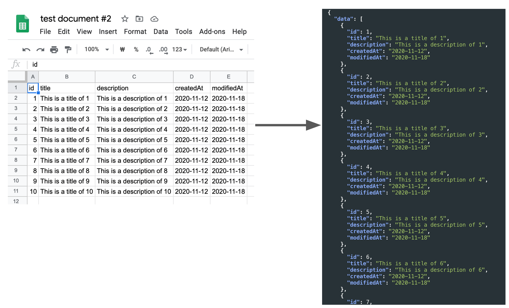

# Public Google Sheets Parser

[](https://github.com/fureweb-com)
[](https://img.shields.io/github/checks-status/fureweb-com/public-google-sheets-parser/main)
[](https://www.npmjs.com/package/public-google-sheets-parser)
[](https://codecov.io/gh/fureweb-com/public-google-sheets-parser)
[](https://github.com/fureweb-com/public-google-sheets-parser/blob/main/LICENSE)
[](https://standardjs.com)
[](https://hits.seeyoufarm.com)
[](https://github.com/fureweb-com/public-google-sheets-parser/stargazers)
[](https://www.npmjs.com/package/public-google-sheets-parser)
[](https://www.jsdelivr.com/package/npm/public-google-sheets-parser)



### [Demo Page (click here)](https://fureweb-com.github.io/public-google-sheets-parser/)

### Introduction

The Public Google Sheets Parser is a zero-dependency library that enables the use of publicly shared Google Sheets as a data source, akin to a database. Ensure your Google Sheet is public and formatted correctly with headers in the first row for seamless integration.

### Features:

- **Sheet Name or GID Selection:** Fetch data from specific sheets by name or GID (since v1.1.0 and v1.3.0 respectively).
- **Formatted Dates:** While you can opt to retrieve dates in their displayed format within the spreadsheet with `useFormattedDate` (since v1.4.0), it is recommended to use the `useFormat` option available since v1.5.0 for more precise control and accuracy. The `useFormat` option ensures that both numeric and date values are returned in their formatted string representations as they appear in your Google Sheets, providing a more accurate and consistent result.
- **Custom Formatting:** Leverage `useFormat` to get numeric and date values as formatted in Google Sheets (since v1.5.0).
- **Browser and Node.js Support:** Utilize in various environments though note it requires Fetch API compatibility.
- **API Access:** No API key required for the SDK; access data through the provided free API for public sheets.

### Installation

```bash
yarn add public-google-sheets-parser
# OR
npm i public-google-sheets-parser
```

### Usage

Node.js:
```javascript
const PublicGoogleSheetsParser = require('public-google-sheets-parser')
const spreadsheetId = 'your_spreadsheet_id_here'
const parser = new PublicGoogleSheetsParser(spreadsheetId)

parser.parse().then(console.log)
```

Browser:
```html
<script src="https://cdn.jsdelivr.net/npm/public-google-sheets-parser@latest"></script>
<script>
  const parser = new PublicGoogleSheetsParser('your_spreadsheet_id_here')
  parser.parse().then(data => console.log(data))
</script>
```

Vue v2:
```html
<template>
  <div>
    <ul v-if="items.length">
      <li v-for="(item, index) in items" :key="index">{{ item }}</li>
    </ul>
  </div>
</template>

<script>
import PublicGoogleSheetsParser from 'public-google-sheets-parser'

export default {
  data() {
    return {
      items: [],
    }
  },
  mounted() {
    const parser = new PublicGoogleSheetsParser('your_spreadsheet_id_here')
    parser.parse().then(data => {
      this.items = data
    })
  },
}
</script>
```

React:
```javascript
import React, { useState, useEffect } from 'react'
import PublicGoogleSheetsParser from 'public-google-sheets-parser'

const SpreadsheetData = () => {
  const [items, setItems] = useState([])

  useEffect(() => {
    const parser = new PublicGoogleSheetsParser('your_spreadsheet_id_here')
    parser.parse().then(data => {
      setItems(data)
    })
  }, [])

  return (
    <div>
      <ul>
        {items.map((item, index) => (
          <li key={index}>{JSON.stringify(item)}</li>
        ))}
      </ul>
    </div>
  )
}

export default SpreadsheetData
```

### Options and Configurations

- `useFormattedDate`: Although you can parse date values according to the spreadsheet's format using `useFormattedDate`, it is now recommended to use the `useFormat` option for more comprehensive and precise formatting control. The `useFormat` option not only affects dates but also applies to numeric values, ensuring consistency and accuracy across your data.

- `useFormat`: Get data as formatted in the spreadsheet (applies to numbers and dates).
- Specify sheet by name or GID to target specific data ranges.

### Example with Options:
```javascript
const options = { sheetName: 'Sheet4', useFormat: true }
const parser = new PublicGoogleSheetsParser('10WDbAPAY7Xl5DT36VuMheTPTTpqx9x0C5sDCnh4BGps', options)
parser.parse().then((data) => {
  // data will be like below:
  // [
  //   {
  //     date: '2024년 1월 1일 월요일 오전 12시 0분 0초',
  //     'with-format': '₩2,000.00',
  //     'without-format': '5678'
  //   },
  //   {
  //     date: '2024년 12월 1일 일요일 오전 12시 0분 0초',
  //     'with-format': '₩2,000.00',
  //     'without-format': '1234'
  //   }
  // ]
})

parser.setOption({ useFormat: false })
parser.parse().then((data2) => {
  // data2 will be like below:
  // [
  //   {
  //     date: 'Date(2024,0,1,0,0,0)',
  //     'with-format': 2000,
  //     'without-format': 5678
  //   },
  //   {
  //     date: 'Date(2024,11,1,0,0,0)',
  //     'with-format': 2000,
  //     'without-format': 1234
  //   }
  // ]
})
```

### License

This project is licensed under the MIT License - see the [LICENSE](https://github.com/fureweb-com/public-google-sheets-parser/blob/main/LICENSE) file for details.
